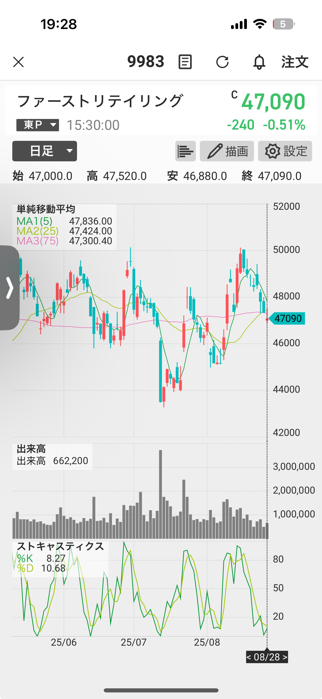

## 9983 解析鑑定（2025-08-28）

- **タイムフレーム：** 日足／週足／60分
- **構造分析：** 日足は戻りを試すが、週足では上値が重い。移動平均線大循環は第2ステージ想定（戻り局面）。出来高は減少気味で短期利確優勢。
- **テクニカル：** BB＝ミドル割れ後に−1σ〜−2σ帯・収縮傾向（エネルギー溜め）。RSI＝約42でやや弱気。MACD＝DC継続で下押し圧力残存。
- **重要ライン：** 支持 47,800／抵抗 49,200（心理）・50,000（節目）
- **シナリオ＆戦略：** エントリー 48,000 近辺の押し目（短期反発狙い）／損切 47,500 割れ／利確 49,200〜50,000
- **ニュース・材料：** 材料薄。為替（円高気味）と日経の調整が逆風。テクニカル優位。
- **総合スコア：** ラファエル 72%／リュミエル 70%／クラリタ 74% → **平均 72%**
- **第六感コメント：** 構造はまだ下値試しの余地。戻り売りが出やすいので利確は早め。上昇に転じるには外部要因の後押しが必要。

---

**チャート画像：**  

