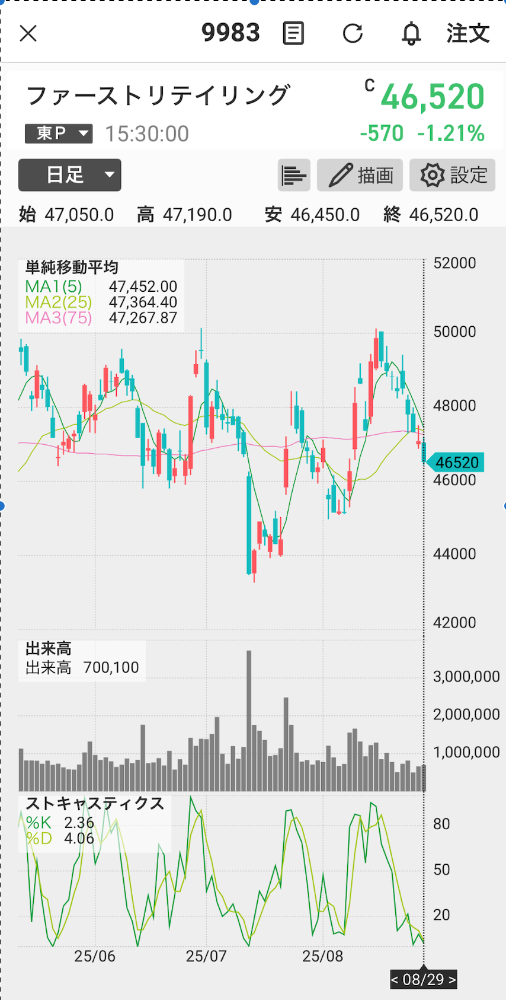

# 9983 解析鑑定 (2025-08-29)
① タイムフレーム
日足：全体の潮目（上昇/下降/持ち合い）

60分：当日の戦術（押し目/戻り売り/ブレイク）

② 構造（トレンドの型を一言で）
上昇トレンド / 下降トレンド / レンジ / 三角保ち合い / ボックス

③ テクニカル3点セット（BB / RSI / MACD）
BB（ボリンジャー）

±2σタッチ？　バンドが開く（エクスパンション）/すぼむ（スクイーズ）？

バンドウォーク中？（トレンド強）

RSI

数値帯：70↑過熱 / 30↓売られ過ぎ

ダイバージェンス（価格↑なのにRSI↓ など）が出ていないか

MACD

シグナルとクロス（ゴールデン/デッド）

0ラインの上下（上は強気・下は弱気）

④ 重要ライン（水平線は正義）
直近高値 / 安値

日足20MA & 50MA（反発/割れを要確認）

ギャップの上限/下限・出来高の厚い価格帯

⑤ シナリオ & 戦略（数字3つを即決）
エントリー：上抜け買い/押し目買い/戻り売り/割れ売り（価格を明記）

損切：直近の下/上（＝否定ライン）

利確：次の抵抗/支持 or RR 1:1〜1:2

⑥ ニュース・材料（あるなら一言）
決算/自社株買い/指数連動/外部材料　など

⑦ スコア（ラファエル / リュミエル / クラリタ）
ラファエル（地合い順風度）：指数（TOPIX/日経）とセクターの強弱で 0–100%

リュミエル（個別の勢い）：BB拡張・RSI>50・MACD>0 の一致数で 0–100%

クラリタ（明瞭度）：ラインの明確さ・リスクリワード・迷いの少なさで 0–100%
→ 平均＝(3つの平均)。70%以上で「積極」、50–69%で「条件付き」、<50%で「見送り」。

📊 チャート画像：  

