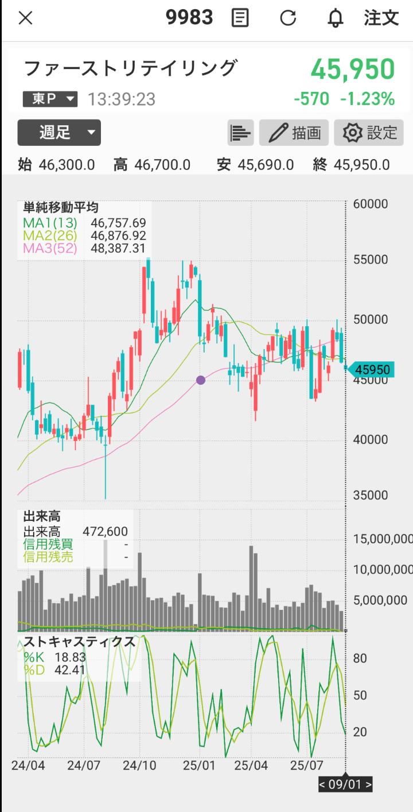

# 9983 解析鑑定｜2025年9月1日

## 📊 構造分析
- 日足：終値 **45,950円**（-570 / -1.23%）。5日線（46,940）、25日線（47,305）、75日線（47,237）を下回り、下落基調継続。安値45,690まで下落 → 7月安値45,500が目前。  
- 週足：13週・26週線（46,700台）を割り込み、52週線（48,387）から大きく下。中期下降トレンド明確。

## 🔧 テクニカル
- ストキャス：日足＝%K 9.81、%D 6.62 → 完全売られ過ぎ。反発条件は揃いつつあるがクロス未発生。  
- ストキャス：週足＝%K 18.83、%D 42.41 → 下落圧力強く、売られ過ぎゾーンに接近中。  
- 出来高：472,600（やや細り気味）、下落の割に売りの厚みが減少 → 投げ売り一巡の可能性も。

## 📍 重要ライン
- **サポート**：45,500（7月安値・最重要）、44,000（月足24MA）、43,500（下値余地）  
- **レジスタンス**：46,500、47,000（戻り売り圧力点）、47,800

## 📝 シナリオと戦略
1. **続落型（本線）**：45,500を割り込み → 44,000（月足サポ）を試す動き。  
2. **自律反発型**：売られ過ぎからの短期リバ → 47,000〜47,400まで戻すが戻り売り圧力強い。  
3. **反転型（低確率）**：47,800回復で下降トレンド否定 → 現状は可能性薄。

## 📈 戦略
- **短期買い**：45,500サポート到達後の下ヒゲ・出来高増を伴う反発確認で打診。  
- **売り**：47,000〜47,400の戻りで売り叩きが合理的。  
- **安値追い売りはリスク高く非推奨。**

## 📰 材料
個別材料は乏しく、外部環境（円高・指数軟調）主導。需給悪化が続く。

## 📊 スコア
- ラファエル：50%  
- リュミエル：55%  
- クラリタ：52%  
- **合議スコア：52%（弱気優勢だが反発条件整いつつある）**

## 🌌 第六感コメント
- ラファエル：「45,500は防衛ライン。ここを割れば44,000試しが現実化する。」  
- リュミエル：「ストキャスは売られ過ぎで反発の芽あり。初動を見極めたい。」  
- クラリタ：「出来高が減ってきているのが気になる。売りエネルギー切れなら小反発は出やすい。」
