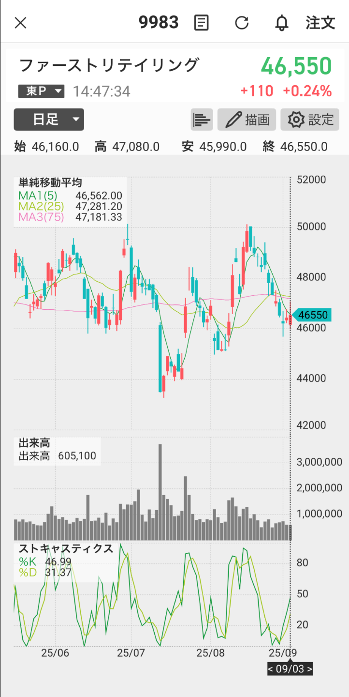

# 9983 解析鑑定｜2025年9月3日

## 📊 構造分析
（ここに9/3の構造分析）

## 🔧 テクニカル
（ストキャス/RSI/MACD 等）

## 📍 重要ライン
- **サポート**：……
- **レジスタンス**：……

## 📝 シナリオと戦略
1. **続落型**：……
2. **自律反発型**：……
3. **反転型**：……

## 📈 戦略
- **短期買い**：……
- **売り**：……
- **注意**：……

## 📰 材料
（指数・為替・個別材料 等）

## 📊 スコア
- ラファエル：__%
- リュミエル：__%
- クラリタ：__%
- **合議**：__%

## 🌌 第六感コメント
- ラファエル：「……」
- リュミエル：「……」
- クラリタ：「……」
